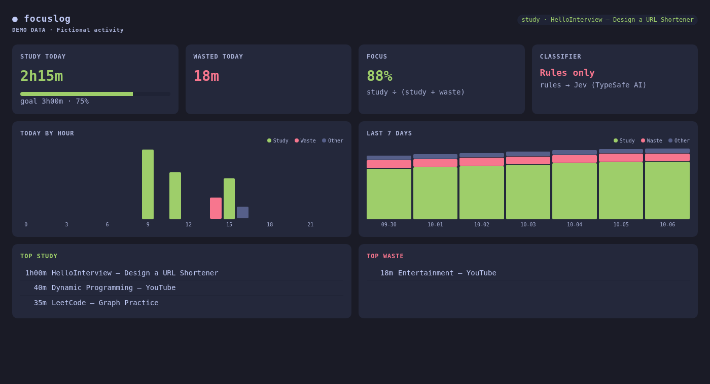
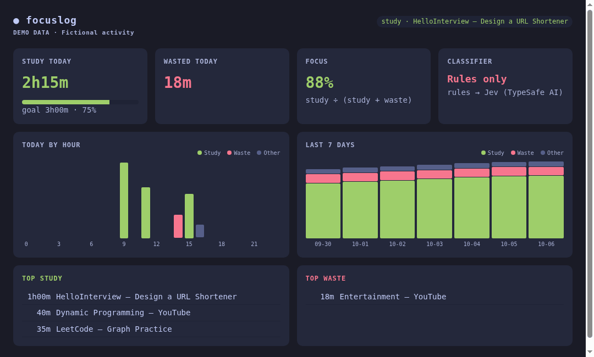
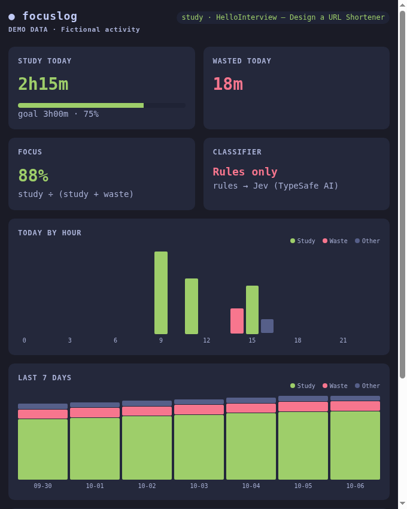
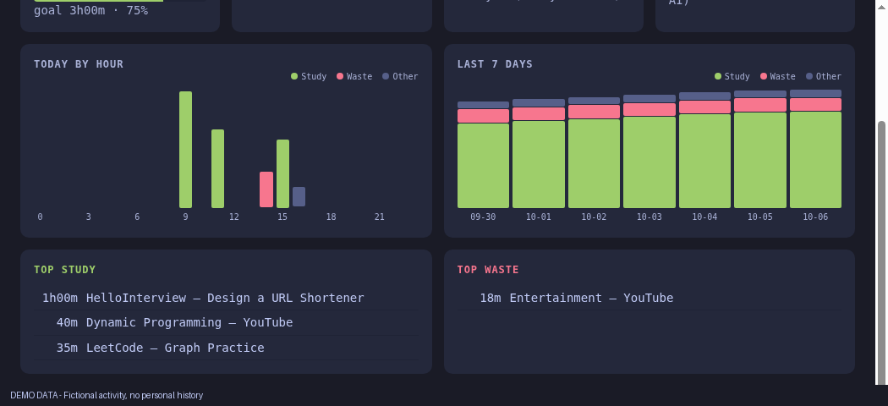

# focuslog

[](#requirements)
[](#requirements)
[](LICENSE)

**A local study and time-use tracker for Omarchy and Hyprland.** focuslog samples the active window, estimates whether its activity supports your goal, and summarizes study, waste, and neutral time in a dashboard and bar widget.



> This screenshot uses fictional demo data, not a real activity history. Classification is an estimate; window titles do not always reveal what you are doing.

## What it does

- Samples the focused window about every five seconds using `hyprctl`; skips samples while locked or when no window is active.
- Applies local title and app-class rules in a defined order, and optionally asks Jev (TypeSafe AI) for classifications at specific points. Without a key, classification stays local and rule-based.
- Stores window class, title, duration, and classification in a local SQLite database. Cached classifications are reused; changing the goal or classifier settings clears automatic verdicts while preserving manual corrections.
- Shows today's totals, goal progress, focus percentage, hourly and seven-day charts, and top study/waste titles in a dashboard served on loopback.
- Provides terminal reports, manual labels, configurable notifications, and an optional Omarchy Quickshell bar widget.

## Requirements

- Linux, a Hyprland session (`hyprctl`), and a systemd user session.
- Python 3.11 or later.
- Omarchy Quattro for the native bar widget.
- Optional: a TypeSafe AI API key for Jev classification. No Python packages are required by focuslog.

## Install

```sh
git clone https://github.com/piyush97/focuslog ~/focuslog
cd ~/focuslog
./install.sh
```

The installer copies the app to `~/.local/share/focuslog/app`, creates the `focuslog` command in `~/.local/bin`, installs and starts the `focuslog` systemd user service, and creates a desktop launcher. In Omarchy it also installs/enables the Quickshell widget and adds `SUPER+CTRL+G` to relabel the focused window.

Jev is optional. If `TYPESAFE_API_KEY` is in the environment, the installer uses it. Otherwise it prompts privately; press Enter to use local rules only. The key is stored in `~/.config/focuslog/env` (mode `0600`), never in the repo. See [privacy notes](docs/privacy.md) before enabling hosted classification.

On non-Omarchy Hyprland, the installer prints Waybar guidance instead of installing the Quickshell widget.

### Upgrade

Run `./install.sh` again from the new checkout. It updates the installed app and plugin while preserving your database and existing config. When an old config has no `[jev]` section, the installer backs it up to `config.toml.before-jev` and appends Jev defaults; it leaves an old `[llm]` section untouched but unused.

### Omarchy plugin marketplace

The marketplace plugin is a bar widget; it does not install the background tracker or desktop app by itself. To add the plugin and install the full app:

```sh
omarchy plugin add https://github.com/piyush97/focuslog
cd ~/.config/omarchy/plugins/piyush97.focuslog
./install.sh
```

## Preview locally

Run the built-in demo directly from the checkout—no installation, API key, Hyprland, or activity database required:

```sh
FOCUSLOG_PORT=47616 python3 focuslog.py demo
```

Open `http://127.0.0.1:47616`. All activity is fictional and the page is labeled **DEMO DATA**. The demo never reads your history or sends classifier requests. Press Ctrl+C in the terminal to stop it.

### Dashboard tour



### Screenshots

<details>
<summary>Compact dashboard and activity breakdown</summary>





</details>

See [configuration](docs/configuration.md) for settings.

## Use

Open **focuslog** from your app launcher or run:

```sh
focuslog app                         # dashboard window
focuslog report                      # today + top study/waste titles
focuslog report 7                    # previous seven days
focuslog mark                        # flip the focused window's category
focuslog mark study                  # set a category explicitly
focuslog classify helium "System design interview"  # test classification
journalctl --user -u focuslog -f     # live tracker logs
```

The bar's left click opens the dashboard; right click flips the focused window's label. The `SUPER+CTRL+G` binding does the same. Manual labels are retained across classifier-setting changes.

## Configure

Edit `~/.config/focuslog/config.toml` and restart with `systemctl --user restart focuslog`. Set `daily_goal_minutes = 0` to disable the goal. Full settings and classifier order: [Configuration](docs/configuration.md). Troubleshooting: [Troubleshooting](docs/troubleshooting.md).

## Uninstall

From the source checkout:

```sh
./uninstall.sh
```

This stops the user service and removes the installed app, launcher, keybinding and widget placement. It **keeps** the activity database, config, and API key. With a marketplace-managed plugin checkout, remove the listing separately if desired: `omarchy plugin remove piyush97.focuslog`.

## Data and privacy

Window titles may contain sensitive information. Data is stored locally. When Jev is enabled, the configured goal, window title, and app class are sent to the HTTPS TypeSafe AI endpoint; without a key, there are no classifier requests. The dashboard binds to `127.0.0.1` and is not intended for network exposure. Read [Privacy and data](docs/privacy.md).

## Limitations

- A title-based classifier cannot reliably infer every activity. Use local rules and correct mistakes with manual labeling.
- Jev requires a working network connection and valid account/key; real API behavior is not exercised by offline tests.
- Native Omarchy/Quickshell rendering and clicks should be verified on a Quattro desktop; CI runs mock-backed regression tests. The Omarchy manifest validator is run separately against the pinned Quattro source.

## Contributing

See [CONTRIBUTING.md](CONTRIBUTING.md). Report vulnerabilities privately as described in [SECURITY.md](SECURITY.md). User-facing changes belong in [CHANGELOG.md](CHANGELOG.md).

## License

[MIT](LICENSE) © 2026 Piyush Mehta.
